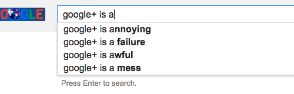

# OpenAI GPT-2 🤖 Re-Implementation 📖

This is a from-scratch, educational re-implementation of the GPT-2 (124M) model in PyTorch based on the OpenAI paper [Language Models are Unsupervised Multitask Learners](https://d4mucfpksywv.cloudfront.net/better-language-models/language_models_are_unsupervised_multitask_learners.pdf) and Andrej Karpathy's Youtube series [Neural Networks: Zero to Hero](https://www.youtube.com/playlist?list=PLAqhIrjkxbuWI23v9cThsA9GvCAUhRvKZ).

>For those looking to learn, this guide assumes familiarity with basic machine learning concepts and the Python language. The internet is already oversaturated with ML and programming courses, so I didn't feel the need to make one. Feel free to continue even if you don't have prior knowledge - you can pick it up along the way! :)

## Table of Contents

1. [Introduction](#introduction)
    - [What is a GPT?](#what-is-a-gpt)
    - [Transformers and Attention]()
2. [Implementation]()
    - [Building the Model]()
    - [Training the Model]()
3. [Learning Resources]()

### Usage

TODO

To run the model:
```
```

Training the model:
```
```


# Introduction

This repo is a beginner-friendly walkthrough of all the concepts needed to build a LLM, inspired by Andrej Karpathy's [nano-gpt](). However, it applies training concepts that are not likely to be accessible to those running regular PCs, as certain optimizations (namely DDP) are not supported by household PCs. Detailed instructions as to how to run and train can be found in a separate section. For those without the time or money to spend on cloud GPUs, [Simple-GPT]() is an alternative, extremely lightweight trainable example that anyone can run from Google Collab for free.

Please enjoy, and happy learning! <3

**Concepts Introduced** (for easy Google searching):
- Machine Learning (ML)
- Neural Networks: backpropagation, optimizers
- Large Language Models (LLMs)
- Generative Pre-Trained Transformer (GPT)
- Self-Attention: flash attention, cross attention
- Tokenization: BPE algorithm
- Distributed Data Parallel (DDP)

## What is a GPT?

<p align="center"></p>

*Formally, a generative pre-trained transformer (GPT) is a large language model that uses transformer-type architecture to perform predictive text generation: As introduced in the 2017 paper [Attention is All You Need](https://arxiv.org/abs/1706.03762), transfomers use the principle of "attention" to provide contextual weight to token embeddings :sleepy:.*

In other words, a GPT is just a really big game of guess-the-next-word with probability distributions. Given some sentence `"The quick brown fox jumped over the lazy ____ "`, a GPT would try to predict the next word. A well-trained model would probably predict the word `"dog"` with high probability. Similarly, it should predict the word `"blue"` for the phrase `"The sky is ___"`, and `"sun"` for `"The Earth revolves around the __"`. If we let it continue running, we can see how we might generate longer lengths of text by just recursively passing in the output of the GPT back as an input, and continually having it predict the next word. 

<p align="center"></p>

It's basically just better autocomplete. The main difference that separates ChatGPT from your standard autocomplete being :sparkles: *context* :sparkles:. 

Most autocomplete algorithms work based on frequency and/or prefix trees - that is, when you type some words or letters, autocomplete will find the most commonly used variation of that phrase and suggest it to you. 

<p align="center"></p>

This is also quite similar to how some naive language models work - based on the last character or word entered, the model will try to predict what comes next. We generally refer to these as [*bigram language models*](https://en.wikipedia.org/wiki/Word_n-gram_language_model) since they generate the next word by looking at the one before it. However, this obviously isn't how communication works in practice. Context is important - how else would we differentiate the word "mole" in the phrase "1 mole of carbon dioxide" vs "a star-nosed mole rat"? To a bigram language model, semantics are not important. Or rather, it doesn't even have the ability to understand context since it's limited to a single word. 

So, what if we tried expanding the context? If we pass two, or even more words into the model, it should theoretically be able to make better predictions, right? Well, not quite. In cases like the "mole" mentioned previously, maybe. But when the sentence structure is very similar, the model will struggle. For example, to correctly predict the gender in the phrases "Sheila is a ____ " vs "Bobby is a ____", the language model would need to understand that "Sheila" is typically a girl's name whereas "Bobby" typically corresponds to a boy. Only by making that distinction could the model be able to correctly fill in the blank with "boy" or "girl" more than 50% of the time. 

Context is important for our model to produce coherent sentences. Without it, we're not any better than regular autocomplete. Naturally, we want a way for our model to understand the deeper "meaning" behind each string of text it parses - some way to *encode* the semantics of what it sees. 

### Tokenization & Embeddings

We begin by splitting our text into *tokens*. Each token is a fragment of text - a character, a word, or some consecutive substring. We then *encode* each token to a specific set of numerical values - a process called *embedding*. Embedding is a way for us to numerically encode the meaning behind pieces of text. Just like how the function $f(x)=x$ maps independent variables to dependent values, we want to map our tokens to some specific, semantic meaning encoded via our embeddings. Our embeddings themselves are just arrays of numbers - high-dimensional vectors of randomly initialized values. They won't provide any useful information to us humans, but as we train our model, we want it to adjust these embeddings  

Our solution to this is an **embedding matrix** - a really large, high-dimensional matrix of values that serves as a numerical representation of the text. Specifically, we split our text into **tokens**.  Each token has a unique integer value that corresponds to some specific row in the embedding matrix. 

## Transformers - "Attention is All You Need"

Let's introduce the concept of **attention**. 

# Implementation

# Learning Resources

> *If you can't explain it simply, you don't understand it well enough. - Albert Einstein*

My writings are by no means 100% correct - they serve as means to teach both others and myself. Please do your own research as well. I've linked some helpful resources below. As always, happy learning! :)

- [3Blue1Brown - Machine Learning Playlist](https://www.youtube.com/watch?v=aircAruvnKk&list=PLZHQObOWTQDNU6R1_67000Dx_ZCJB-3pi)
- [Andrej Karpathy - Neural Networks: Zero to Hero](https://www.youtube.com/watch?v=VMj-3S1tku0&list=PLAqhIrjkxbuWI23v9cThsA9GvCAUhRvKZ)
- [Huggingface Pytorch GPT-2 Implementation](https://github.com/huggingface/transformers/blob/main/src/transformers/models/gpt2/modeling_gpt2.py#L41)
- [OpenAI TensorFlow GPT-2 Implementation](https://github.com/openai/gpt-2/blob/master/src/model.py)
- ["Attention is All You Need" Paper](https://arxiv.org/abs/1706.03762)